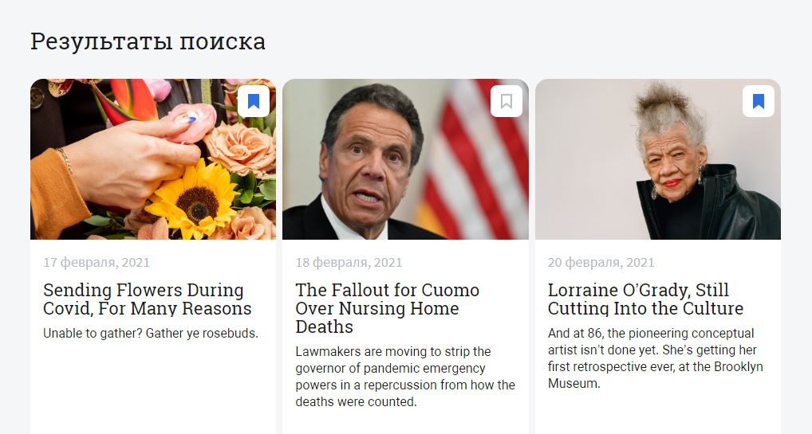

## Diploma news-explorer-frontend

Ссылка на **[News Explorer](http://newsonthecloud.students.nomoredomains.monster/)**

Backend проекта можно помотреть **[здесь](https://github.com/yuliaiv-iv/news-explorer-api)**

### Описание

Сервис, в котором можно найти новости по запросу и сохранить в личном кабинете. Поиск осуществляется по ключевому слову отправляя запрос к сервису **[News API](newsapi.org)**. Сайт состоит из двух страниц: главная и страница с сохранёнными новостями, на ней отображаются материалы, которые пользователь добавил в избранное. Всплывающие окна (попапы): с формой входа и с формой регистрации, чтобы пользователь мог сохранить новости в личном кабинете

### Технологии

* **`React`**
* **`React HOOK`**
* **`React router dom`**
* **`HTML5, CSS3`**
* **`адаптивная верстка`** с использованием **`медиа-запросов`**
* **`flex`** и **`grid-layout`**
* Live **`валидация форм`**
* **`Local storage и JWT`** 
* **`регистрация и авторизация`**
* **`API для аутентификации пользователей и сохранения/удаления статей`** 

### Методологии
* ООП
* БЭМ

### Запуск и установка
* `npm install`
* `npm start`

    
    
    
    

